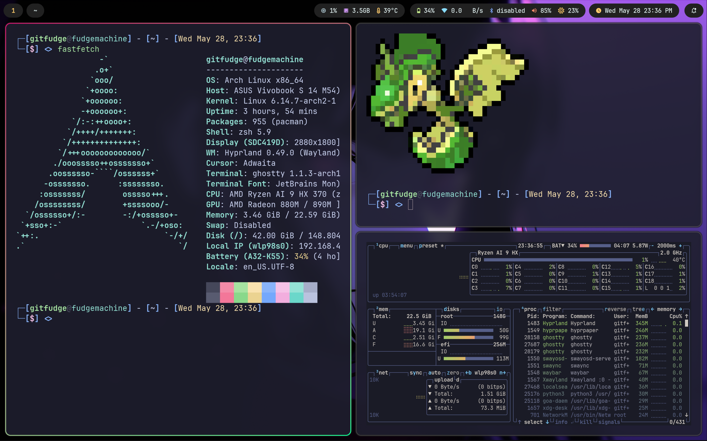
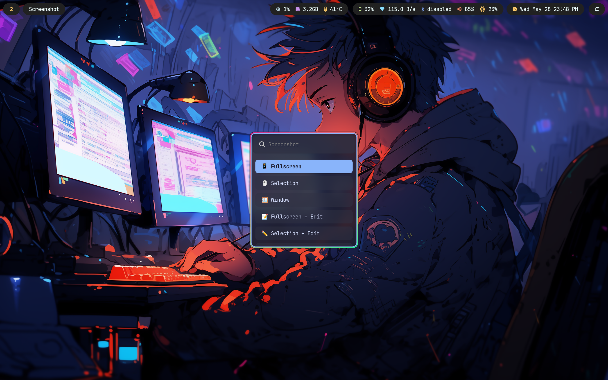

# Arch Linux Dotfiles

A complete Hyprland config that taught me a lot about desktop environments, inspired from the numerous awe-inspiring r/unixporn posts that made me finally do it for myself.

## Features

- **Window Manager**: Hyprland (Wayland compositor)
- **Status Bar**: Waybar with custom styling
- **Application Launcher**: Wofi with custom themes
- **Notifications**: SwayNC notification daemon
- **Terminal Emulators**: Kitty and Ghostty with Zsh shell
- **Screenshot Tools**: Grim, Slurp, Swappy, Flameshot, and jq
- **Wallpaper Manager**: Hyprpaper with custom wallpapers
- **Development Tools**: Rust (rustup), Go, Deno, Node.js, Ruby-install, Lazygit
- **Virtualization**: Docker, Docker Compose, QEMU
- **System Tools**: asusctl, nbfc (fan control), Blueman (Bluetooth)
- **Browser**: Zen Browser
- **Shell Enhancements**: Zsh with Starship prompt, fzf, ripgrep, eza, bat
- **Fonts**: Noto Sans, Fira Code, Nerd Fonts, DejaVu
- **Custom Scripts**: Power menu, lock screen, wallpaper switcher, workspace listener, fan control

## Installation

### Quick Install (Recommended)

Run the automated setup script directly from GitHub:

```bash
curl -fsSL https://raw.githubusercontent.com/gitfudge0/arch-dots/main/setup.sh | bash
```

## Screenshots







### Manual Installation

1. Clone the repository:

```bash
git clone https://github.com/gitfudge0/arch-dots.git
cd arch-dots
```

2. Run the setup script:

```bash
chmod +x setup.sh
./setup.sh
```

### What the Setup Script Does

The installation script will:

- Verify you're running Arch Linux
- Install required packages:
  - **WM & UI**: Hyprland, Waybar, Wofi, SwayNC
  - **Terminals**: Kitty, Ghostty
  - **Development**: Rustup, Go, Deno, Node.js, Ruby-install, Lazygit
  - **Screenshots**: Grim, Slurp, Swappy, Flameshot
  - **Virtualization**: Docker, Docker Compose, QEMU
  - **System**: asusctl, nbfc, Blueman, Zen Browser
  - **Shell**: Zsh, Starship, fzf, ripgrep, eza, bat
  - **Fonts**: Noto Sans, Noto CJK, Noto Emoji, Fira Code, DejaVu, Nerd Fonts
- Install AUR packages using yay (installs yay if not present)
- Backup your existing configurations to `~/.config-backup-<timestamp>`
- Download and install all configuration files
- Enable necessary system services (bluetooth, NetworkManager, docker)
- Configure docker for current user
- Set proper file permissions

## Key Bindings

These are some to get you started. For a full list, check out the hyprland config.

- **Super + Return**: Open terminal
- **Super + B**: Open Zen Browser
- **Super + R**: Open application launcher (wofi)
- **Super + X**: Open power options menu
- **Super + Shift + S**: Open screenshot menu (grim + slurp + swappy)
- **Super + Shift + F**: Open Flameshot GUI
- **Super + Q**: Close window

## Development Tools

After installation, configure development tools:

```bash
# Install Rust tools
rustup component add rust-analyzer

# Verify Go installation
go version

# Verify Node.js
node --version
npm --version

# Docker (after login)
docker ps

# Set default shell
chsh -s /bin/zsh
```

## Shell Configuration

The Zsh configuration includes:

- **Theme**: Robbyrussell (via oh-my-zsh)
- **Prompt**: Starship with custom formatting
- **Plugins**: git, z, fzf, syntax highlighting, autosuggestions
- **Aliases**:
  - `ls` → `eza -lha` (better listing)
  - `cat` → `bat` (syntax highlighting)
  - `grep` → `rg` (ripgrep)
  - `find` → `fd`

Customize the Starship prompt by editing `~/.config/starship.toml`.

## System Utils

- **asusctl**: ASUS device control (OLED brightness, etc.)
- **nbfc**: Notebook fan control - edit `/etc/nbfc/profiles` for your laptop
- **Blueman**: GUI for Bluetooth device management

## GTK Configuration

GTK theme is set to Adwaita Dark with Papirus icons. Edit `~/.config/gtk/settings.ini` to change theme.

---

**Note**: This configuration is designed specifically for Arch Linux with Hyprland. Backup your existing configurations before installation.

